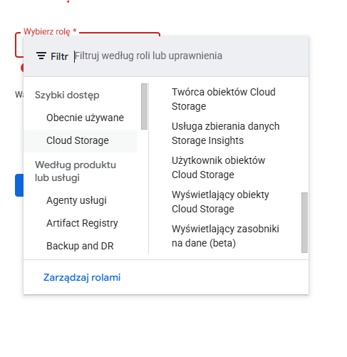

## Prerequisites to running/developing the project locally

# Database

In order to run the project locally, you need to create/have your own database (either local or remote) (for example you can follow [this](https://dev.mysql.com/doc/mysql-getting-started/en/) tutorial).

After that, you should connect the project to the database via connection string:

- example form of connection string: <db_provider (ex. mysql)>://<db_username (ex. root)>:<db_password>@<db_hostname (ex. localhost:3306)>/<db_database_name (ex. zpp)>
- create file called .env in root directory of the project and enter
  `  DATABASE_URL=<your connection string>`
- modify file prisma/schema.prisma by entering your database provider in 'provider' field (ex. mysql, postgres)
- run `npx prisma migrate dev` to import database schema to your database server (it will create all the tables in your db automatically)
- run `npx prisma generate` to generate @prisma package (this way, you will be able to use prisma object and methods instead of writing plain SQL commands)

# Next auth

To make next authentication work, add new env variables in .env file:

```bash
NEXTAUTH_URL=<your url (ex. http://localhost:3000)>
NEXTAUTH_SECRET=<any secret string (should be optional in dev mode)>
google_oauth_id=<google oauth id, can be taken from>
google_oauth_secret=<google oauth secret, can be taken from google cloud platform>
```

## Running/Developing app

- To start the application, run

```bash
npm run dev
# or
npm run build
npm start
```

- If you want to modify database model, run

```bash
npx prisma migrate dev --name <your-migration-name>
```


Killowanie procesu na porcie 3000
netstat -ano | findstr :3000
taskkill /PID 19272 /F